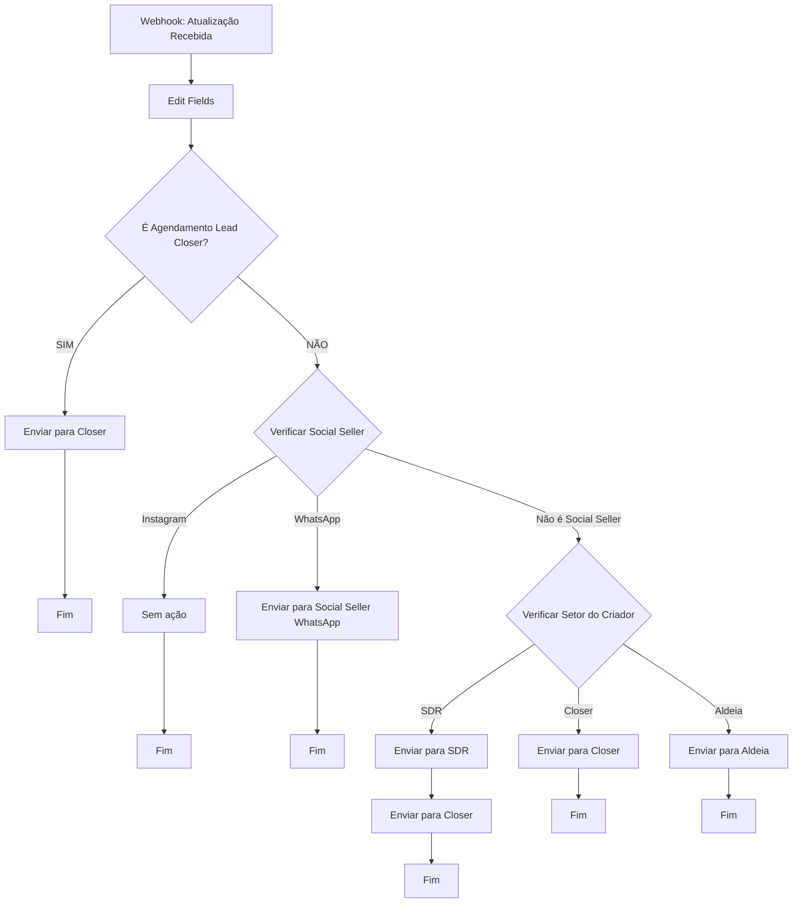

# Documentação: Workflow de Atualização de Agendamento

## Visão Geral

O workflow **"Atualização de Agendamento"** é responsável por processar as atualizações de status e modificações realizadas em agendamentos existentes no TradeSpot 2.0, distribuindo essas informações para as respectivas conexões no sistema UnniChat com base no evento, tipo de agendamento e setor do criador.

---

## Fluxo Principal

O workflow é acionado por um **webhook único** que recebe as atualizações de agendamentos. O fluxo se ramifica com base em regras condicionais que consideram:

1. Nome do evento associado ao agendamento
2. Tipo de agendamento (Social Seller, Lead Closer, etc.)
3. Setor do criador (SDR, Closer, Aldeia)

---

## Webhook de Entrada

### Configuração do Webhook

- **Webhook ID**: `eaff56ab-d661-460a-811c-f6a2677142ed`
- **URL**: `https://n8n.tradestars.com.br/webhook/eaff56ab-d661-460a-811c-f6a2677142ed`
- **Método**: POST
- **Content-Type**: application/json

---

## Estrutura de Dados Recebidos

O webhook recebe um payload JSON com a seguinte estrutura:

```json
{
  "body": {
    "id": "uuid",
    "client_id": "uuid",
    "date": "2026-01-12",
    "time": "18:30:00+00",
    "type": "Tipo do Agendamento",
    "status": "Realizado|Pendente|Reagendado|No-show|Cancelado",
    "phone": "5541998618483",
    "attendant_name": "Nome do Atendente",
    "event_name": "Nome do Evento",
    "creator_sector": "SDR|Closer|Aldeia|Social Seller",
    "meet_link": "https://meet.google.com/...",
    "notes": "string",
    "additional_info": "string"
  }
}
```

---

## Processamento de Dados

### Transformação de Campos (Edit Fields)

Os dados recebidos são transformados para o seguinte formato:

| Campo Original | Campo Transformado | Tipo |
|----------------|-------------------|------|
| `phone` | `telefone` | string |
| `status` | `status` | string |
| `attendant_name` | `atendente` | string |
| `type` | `tipo` | string |
| `event_name` | `evento` | string |

---

## Lógica de Roteamento

O workflow utiliza uma estrutura de decisão em cascata para determinar o destino da atualização:

### Nível 1: Verificação de Evento - "Agendamento Lead Closer"

**Condição**: `evento === "Agendamento Lead Closer"`

- **TRUE**: Envia diretamente para Conexão "Closer"
  - URL: `https://unnichat.com.br/a/start/MiRTIMs4YvEarv9ojO5L`
  - Parâmetros: telefone, status, atendente
  
- **FALSE**: Procede para verificação de Social Seller

---

### Nível 2: Verificação de Social Seller

**Condições**:

#### Opção 1: Instagram - Social Seller
- **Condição**: `evento === "0126 - Social Seller (Instagram)"`
- **Ação**: Branch vazio (sem envio)

#### Opção 2: WhatsApp - Social Seller
- **Condição**: `evento === "0126 - Social Seller (WhatsApp)"`
- **Ação**: Envia para Conexão "Social Seller (WhatsApp)"
  - URL: `https://unnichat.com.br/a/start/j5qNWAfMEuBJmKabYeY8`
  - Parâmetros: telefone, status, atendente, tipo

#### Opção 3: Não é Social Seller
- **Condição**: `evento NOT CONTAINS "Social Seller"`
- **Ação**: Procede para verificação por setor do criador

---

### Nível 3: Verificação por Setor do Criador

**Condições**:

#### Opção 1: Criador do setor SDR
- **Condição**: `creator_sector === "SDR"`
- **Ação Sequencial**:
  1. Envia para Conexão "SDR"
     - URL: `https://unnichat.com.br/a/start/j5qNWAfMEuBJmKabYeY8`
     - Parâmetros: telefone, status, atendente, tipo
  2. Depois envia para Conexão "Closer"
     - URL: `https://unnichat.com.br/a/start/MiRTIMs4YvEarv9ojO5L`
     - Parâmetros: telefone, status, atendente

#### Opção 2: Criador do setor Closer
- **Condição**: `creator_sector === "Closer"`
- **Ação**: Envia para Conexão "Closer"
  - URL: `https://unnichat.com.br/a/start/MiRTIMs4YvEarv9ojO5L`
  - Parâmetros: telefone, status, atendente

#### Opção 3: Criador do setor Aldeia
- **Condição**: `creator_sector === "Aldeia"`
- **Ação**: Envia para Conexão "Aldeia"
  - URL: `https://unnichat.com.br/a/start/WkqMYM7Takkpp2uvmO3o`
  - Parâmetros: telefone, status, atendente, tipo

---

## Diagrama de Fluxo de Decisão



---

## Conexões UnniChat

### Resumo das Conexões

| Nome da Conexão | URL Endpoint | ID Interno |
|-----------------|--------------|------------|
| Closer | `https://unnichat.com.br/a/start/MiRTIMs4YvEarv9ojO5L` | MiRTIMs4YvEarv9ojO5L |
| SDR | `https://unnichat.com.br/a/start/j5qNWAfMEuBJmKabYeY8` | j5qNWAfMEuBJmKabYeY8 |
| Social Seller (WhatsApp) | `https://unnichat.com.br/a/start/j5qNWAfMEuBJmKabYeY8` | j5qNWAfMEuBJmKabYeY8 |
| Aldeia | `https://unnichat.com.br/a/start/WkqMYM7Takkpp2uvmO3o` | WkqMYM7Takkpp2uvmO3o |

---

## Parâmetros Enviados para Cada Conexão

### Conexão "Closer"
```json
{
  "telefone": "5541998618483",
  "status": "Realizado",
  "atendente": "Nome do Atendente"
}
```

### Conexão "SDR"
```json
{
  "telefone": "5541998618483",
  "status": "Realizado",
  "atendente": "Nome do Atendente",
  "tipo": "Ligação SDR"
}
```

### Conexão "Social Seller (WhatsApp)"
```json
{
  "telefone": "5541998618483",
  "status": "Realizado",
  "atendente": "Nome do Atendente",
  "tipo": "Ligação Closer"
}
```

### Conexão "Aldeia"
```json
{
  "telefone": "5541998618483",
  "status": "Realizado",
  "atendente": "Nome do Atendente",
  "tipo": "Agendamento Pessoal"
}
```

---

## Mapeamento de Eventos e Destinos

| Evento | Condição Adicional | Destino Final |
|--------|-------------------|---------------|
| Agendamento Lead Closer | - | Closer |
| 0126 - Social Seller (Instagram) | - | Nenhum (sem envio) |
| 0126 - Social Seller (WhatsApp) | - | Social Seller (WhatsApp) |
| Qualquer outro evento | creator_sector = SDR | SDR → Closer (sequencial) |
| Qualquer outro evento | creator_sector = Closer | Closer |
| Qualquer outro evento | creator_sector = Aldeia | Aldeia |

---

## Casos de Uso Detalhados

### Caso 1: Atualização de Agendamento Lead Closer

**Entrada**:
```json
{
  "body": {
    "event_name": "Agendamento Lead Closer",
    "status": "Realizado",
    "phone": "5541998618483",
    "attendant_name": "João Silva",
    "type": "Ligação Closer"
  }
}
```

**Fluxo**:
1. Edit Fields transforma os dados
2. Condição "If" detecta "Agendamento Lead Closer"
3. Envia para Conexão "Closer" com telefone, status e atendente
4. Finaliza

---

### Caso 2: Atualização de Social Seller (WhatsApp)

**Entrada**:
```json
{
  "body": {
    "event_name": "0126 - Social Seller (WhatsApp)",
    "status": "Pendente",
    "phone": "5541998618483",
    "attendant_name": "Maria Santos",
    "type": "Ligação Closer"
  }
}
```

**Fluxo**:
1. Edit Fields transforma os dados
2. Condição "If" retorna FALSE
3. Switch "Social Seller" detecta "WhatsApp"
4. Envia para Conexão "Social Seller (WhatsApp)" com todos os parâmetros
5. Finaliza

---

### Caso 3: Atualização de Agendamento Criado por SDR

**Entrada**:
```json
{
  "body": {
    "event_name": "0126 - On The Road 2.0",
    "status": "Reagendado",
    "phone": "5541998618483",
    "attendant_name": "Carlos Oliveira",
    "type": "Upgrade",
    "creator_sector": "SDR"
  }
}
```

**Fluxo**:
1. Edit Fields transforma os dados
2. Condição "If" retorna FALSE
3. Switch "Social Seller" retorna "Não é"
4. Switch por setor detecta "SDR"
5. Envia PRIMEIRO para Conexão "SDR"
6. Depois envia para Conexão "Closer" (sequencial)
7. Finaliza

---

### Caso 4: Atualização de Social Seller (Instagram)

**Entrada**:
```json
{
  "body": {
    "event_name": "0126 - Social Seller (Instagram)",
    "status": "Cancelado",
    "phone": "5541998618483",
    "attendant_name": "Ana Costa"
  }
}
```

**Fluxo**:
1. Edit Fields transforma os dados
2. Condição "If" retorna FALSE
3. Switch "Social Seller" detecta "Instagram"
4. Branch vazio (sem ação)
5. Finaliza SEM enviar para nenhuma conexão

---

## Status de Agendamento Suportados

O workflow processa os seguintes status de agendamentos:

- **Realizado**: Agendamento foi realizado com sucesso
- **Pendente**: Agendamento ainda não ocorreu
- **Reagendado**: Agendamento foi reagendado para nova data/hora
- **No-show**: Cliente não compareceu ao agendamento
- **Cancelado**: Agendamento foi cancelado

---

## Configurações do Workflow

- **Estado**: Ativo (`active: true`)
- **Ordem de Execução**: v1
- **ID do Workflow**: `aYJcIwmXGfcIRxXl`
- **Version ID**: `b4e66242-8e93-45f3-a9d1-ea0f23614a51`

---

## Matriz de Decisão

| Evento | Creator Sector | Primeira Ação | Segunda Ação | Parâmetros Enviados |
|--------|----------------|---------------|--------------|---------------------|
| Agendamento Lead Closer | Qualquer | Enviar Closer | - | telefone, status, atendente |
| 0126 - Social Seller (Instagram) | Qualquer | Nenhuma | - | - |
| 0126 - Social Seller (WhatsApp) | Qualquer | Enviar Social Seller (WhatsApp) | - | telefone, status, atendente, tipo |
| Outros Eventos | SDR | Enviar SDR | Enviar Closer | telefone, status, atendente, tipo |
| Outros Eventos | Closer | Enviar Closer | - | telefone, status, atendente |
| Outros Eventos | Aldeia | Enviar Aldeia | - | telefone, status, atendente, tipo |

---

## Integração com TradeSpot 2.0

### Configuração no Backend

Para que o workflow funcione corretamente, o TradeSpot 2.0 deve enviar uma requisição POST para o webhook sempre que:

1. O status de um agendamento for alterado
2. O atendente de um agendamento for modificado
3. Qualquer informação relevante do agendamento for atualizada

### Código de Referência (TypeScript/JavaScript)

```typescript
// Exemplo de chamada do webhook de atualização
const notifyUpdate = async (appointment: Appointment) => {
  const payload = {
    body: {
      id: appointment.id,
      client_id: appointment.client_id,
      date: appointment.date,
      time: appointment.time,
      type: appointment.type,
      status: appointment.status,
      phone: appointment.phone,
      attendant_name: appointment.attendant_name,
      event_name: appointment.event_name,
      creator_sector: appointment.creator_sector,
      meet_link: appointment.meet_link,
      notes: appointment.notes,
      additional_info: appointment.additional_info
    }
  };

  await fetch('https://n8n.tradestars.com.br/webhook/eaff56ab-d661-460a-811c-f6a2677142ed', {
    method: 'POST',
    headers: {
      'Content-Type': 'application/json',
    },
    body: JSON.stringify(payload)
  });
};
```

---

## Checklist de Manutenção

- [ ] Verificar se o webhook está respondendo corretamente
- [ ] Validar se todas as conexões UnniChat estão ativas
- [ ] Conferir se os endpoints das conexões estão atualizados
- [ ] Testar cada branch de decisão individualmente
- [ ] Monitorar logs de erro no n8n
- [ ] Verificar se o campo `creator_sector` está sendo enviado corretamente
- [ ] Validar formatação e valores de status

---

## Troubleshooting

### Webhook não está sendo acionado

**Sintomas**: Atualizações de agendamento não estão sendo processadas

**Verificações**:
- Confirme se o workflow está ativo no n8n
- Verifique se a URL do webhook está correta no código do TradeSpot 2.0
- Consulte logs de erro no servidor n8n
- Teste a URL do webhook manualmente com Postman ou cURL

**Solução**:
```bash
# Teste manual do webhook
curl -X POST https://n8n.tradestars.com.br/webhook/eaff56ab-d661-460a-811c-f6a2677142ed \
  -H "Content-Type: application/json" \
  -d '{"body": {"event_name": "Test", "status": "Pendente", "phone": "5541999999999", "attendant_name": "Test", "type": "Test"}}'
```

---

### Atualizações não estão chegando na conexão correta

**Sintomas**: Dados são enviados para a conexão errada ou não são enviados

**Verificações**:
- Confirme se o campo `event_name` está correto
- Verifique se o campo `creator_sector` está sendo populado
- Valide a lógica de condições no workflow
- Revise os logs de execução no n8n

**Solução**:
1. Ative o modo de debug no n8n
2. Execute uma atualização de teste
3. Observe qual branch está sendo seguido
4. Ajuste as condições conforme necessário

---

### Conexões UnniChat retornando erro

**Sintomas**: HTTP 4xx ou 5xx ao tentar enviar dados

**Verificações**:
- Confirme se as URLs das conexões estão corretas
- Verifique se as conexões existem no UnniChat
- Valide se os parâmetros enviados estão no formato esperado
- Consulte logs do UnniChat

**Solução**:
1. Acesse o UnniChat
2. Verifique se as conexões ainda existem e estão ativas
3. Teste as URLs manualmente
4. Atualize as URLs no workflow se necessário

---

### Campo `creator_sector` está vazio ou incorreto

**Sintomas**: Agendamentos não são roteados corretamente por setor

**Verificações**:
- Confirme se o TradeSpot 2.0 está enviando `creator_sector`
- Verifique se o valor corresponde a "SDR", "Closer" ou "Aldeia"
- Valide a lógica de extração do setor no backend

**Solução**:
1. Adicione logging no backend para verificar o valor de `creator_sector`
2. Certifique-se de que o campo está sendo extraído corretamente do usuário criador
3. Ajuste a query ou lógica de extração se necessário

---

## Diferenças entre Criação e Atualização

| Aspecto | Workflow de Criação | Workflow de Atualização |
|---------|-------------------|------------------------|
| Webhooks | 5 webhooks diferentes (por tipo) | 1 webhook único |
| Integração UnniChat | Atualiza tags e campos personalizados | Apenas envia notificações para conexões |
| Dados enviados | Dados completos do agendamento | Apenas telefone, status, atendente e tipo |
| Lógica de roteamento | Baseada apenas no evento | Baseada em evento E setor do criador |
| Ações sequenciais | Não | Sim (SDR envia para dois destinos) |

---

## Monitoramento e Logs

### Métricas Importantes

- Taxa de sucesso de execuções
- Tempo médio de processamento
- Número de atualizações por conexão
- Taxa de erro por tipo de evento
- Distribuição de atualizações por setor

### Logs Recomendados

```javascript
// Adicionar logging no início do workflow
console.log('[Atualização] Webhook acionado:', {
  timestamp: new Date().toISOString(),
  event_name: $json.body.event_name,
  status: $json.body.status,
  creator_sector: $json.body.creator_sector
});

// Adicionar logging antes de cada envio
console.log('[Atualização] Enviando para conexão:', {
  conexao: 'Nome da Conexão',
  telefone: $json.telefone,
  status: $json.status
});
```

---

## Histórico de Alterações

| Data | Versão | Descrição |
|------|--------|-----------|
| 2026-01-26 | 1.0 | Documentação inicial do workflow de atualização |

---

## Responsáveis

- **Desenvolvimento**: Equipe TradeStars
- **Manutenção**: Equipe de Desenvolvimento TradeSpot 2.0
- **Suporte**: n8n.tradestars.com.br

---

## Suporte

Para dúvidas ou problemas relacionados a este workflow, entre em contato com a equipe de desenvolvimento TradeStars.

---

**Última atualização**: 26/01/2026
